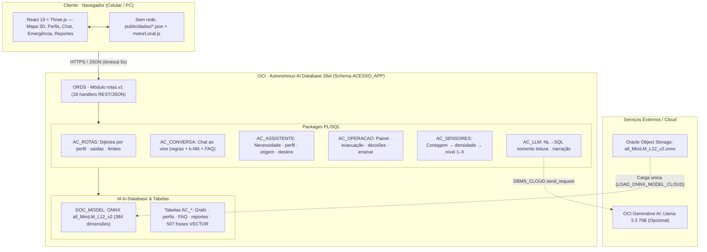

# 🧭 Rotas Acessíveis · Tech4Change 2026 (FIAP)

[](https://www.oracle.com/autonomous-database/)
[](https://react.dev/)
[](https://www.typescriptlang.org/)
[](https://threejs.org/)
[](https://docs.oracle.com/en/database/)
[](https://www.oracle.com/database/technologies/appdev/rest.html)
[](https://vitejs.dev/)

> **Roteamento por perfil de acessibilidade em eventos, com motor de rotas, busca semântica e modelo de embedding executando dentro do Oracle Autonomous AI Database 26ai. O front consome apenas REST (ORDS) e mantém um motor local espelho para operar sem rede.**

| Item | Valor |
| :--- | :--- |
| **Banco de dados** | Oracle Autonomous AI Database 26ai · `23.26.3.3.0` · OCI São Paulo |
| **Schema** | `ACESSO_APP` |
| **Repositório** | [github.com/leonardopetruncko/rotas-acessiveis](https://github.com/leonardopetruncko/rotas-acessiveis) |
| **Demonstração** | [leonardopetruncko.github.io/rotas-acessiveis](https://leonardopetruncko.github.io/rotas-acessiveis) |
| **Medições deste documento** | 18/09/2026 |

*Dados sintéticos e plantas ilustrativas. O site publicado corresponde a um build anterior (otimizado para celular); chat, sensores e painel do organizador rodam contra o banco no ambiente local e entram no próximo deploy.*

---

## 1. 📌 Descrição da Solução

Cada evento é modelado como um grafo: `AC_PONTO` são os nós (entradas, stands, cruzamentos, rampas, saídas, serviços) e `AC_TRECHO` são as arestas com distância, presença de degrau, ruído (1–5), lotação (1–5) e flag de bloqueio. 

Quatro perfis (`PADRAO`, `CADEIRANTE`, `MOBILIDADE`, `NEURODIVERGENTE`) carregam pesos e limites de tolerância específicos. O cálculo de menor caminho é um **Dijkstra ponderado** implementado em PL/SQL (`AC_ROTAS`):

$$\text{custo} = \text{distancia} \times \left(1 + \frac{(\text{ruido} - 1) \times \text{peso\_ruido}}{10} + \frac{(\text{lotacao} - 1) \times \text{peso\_lotacao}}{10} + \max(0, \text{lotacao} - \text{lotacao\_limite}) \times \text{fator\_excesso} + \max(0, \text{ruido} - \text{ruido\_limite}) \times \text{fator\_excesso}\right)$$

* Trecho com escada é intransponível se o perfil tem `evita_escada = 'S'`.
* Ponto ou trecho bloqueado é intransponível para todos os perfis.

### Perfis e efeito no mesmo trajeto (Stand Oracle → Sala de Acolhimento, NEXT26)

| Perfil | Evita escada | Peso ruído | Peso lotação | Limite lotação | Limite ruído | Rota |
| :--- | :---: | :---: | :---: | :---: | :---: | :--- |
| **PADRAO** | Não | 1 | 1 | — | — | **84 m** |
| **CADEIRANTE** | Sim | 1 | 4 | 3 | — | **152 m** |
| **MOBILIDADE** | Sim | 1 | 3 | 3 | — | **84 m** |
| **NEURODIVERGENTE** | Não | 6 | 5 | 3 | 3 | **112 m** |

### Funcionalidades Implementadas:
- **Rota por perfil e comparação dos quatro perfis** no mesmo trajeto, com instruções, alertas, metros restantes em multidão e explicação do que foi evitado.
- **Rota de saída / evacuação**: saída viável por perfil, alternativas e saídas interditadas; evacuação acionada pelo organizador (PIN) coloca todos os clientes em modo saída.
- **Assistente conversacional in-database (`AC_CONVERSA`)**: responde sobre lugares, programação, lotação, acessibilidade, saídas e 19 FAQs usando dados do momento, e devolve ação sugerida com `automatica: false`.
- **Apoio opcional do OCI Generative AI**: quando as camadas determinísticas não reconhecem a pergunta, o banco consulta o Llama 3.3 com os dados do evento e a ordem de não inventar; a resposta vem marcada como apoio de IA generativa.
- **Lotação dinâmica**: contagem por trecho $\rightarrow$ densidade (pessoas/m², corredor de 4 m) $\rightarrow$ nível 1–5 (`AC_SENSORES`), com bônus de até 2 níveis por reportes recentes e retenção de 3 h.
- **Painel do organizador**: indicadores, corredores críticos, reportes, decisões por perfil, frases não entendidas e curadoria (*"ensinar a assistente"*, que grava a frase já vetorizada).
- **Registro de decisão humana (`AC_DECISAO`)**: sugerido $\times$ escolhido (`SEGUIU`, `OUTRA_OPCAO`, `TROCOU_PERFIL`).
- **Operação sem rede**: timeout de 5 s no fetch e fallback para cópia JSON do mapa + `motorLocal.js`, espelho do `AC_ROTAS`.

### Validação Medida (scripts em `db/avaliacao/`)

| Medição | Antes | Atual | Observação |
| :--- | :---: | :---: | :--- |
| **Chat · 56 frases escritas antes do treino** | 73% | **100%** | Medida independente (`conversa_holdout3.json`) |
| **Chat · 60 perguntas do evento** | 35% | **95%** | Conjunto usado também em ajustes anteriores |
| **Chat · 60 frases difíceis (gíria, erro de digitação, bilíngue)** | 80% | **97%** | Ajustado olhando o próprio conjunto |
| **Chat · 30 perguntas fora do escopo** | 4% | **93%** | Inclui injeção de prompt e sofrimento emocional |
| **Alarmes falsos de emergência** | 2 | **0** | 5 emergências reais continuam disparando (regressão) |
| **Multidão evitável · cadeirante, 380 viagens** | 4.624 m | **1.004 m** | **−78%**; mobilidade −77%, neuro −61%; custo ~+20% de distância |
| **Paridade offline × Oracle** | — | **158/158** | `db/snapshot.mjs`, inclui desempate de custos iguais |
| **Carga na API** | — | **~0,1 s** | 40 requisições simultâneas de comparar, HTTP 200 |

---

## 2. 💻 Tecnologias, Linguagens e Frameworks Utilizados

| Camada | Tecnologia | Uso no projeto |
| :--- | :--- | :--- |
| **Banco de dados** | Oracle Autonomous AI Database 26ai (`23.26.3.3.0`, workload APEX, OCI São Paulo) | Dados, regra de negócio, IA e API em um único serviço gerenciado |
| **IA in-database** | ONNX Runtime no Oracle (`DBMS_VECTOR.LOAD_ONNX_MODEL_CLOUD`) · AI Vector Search (`VECTOR`, `VECTOR_EMBEDDING`, `VECTOR_DISTANCE`) | Embedding e k-NN sem tráfego externo |
| **Linguagem de servidor** | PL/SQL + SQL/JSON (`JSON_OBJECT`, `JSON_ARRAYAGG`, `JSON_TABLE`, `JSON_OBJECT_T`) | 6 packages: `AC_ROTAS`, `AC_ASSISTENTE`, `AC_CONVERSA`, `AC_OPERACAO`, `AC_SENSORES`, `AC_LLM` |
| **API** | ORDS embutido no Autonomous · módulo `rotas.v1` | 18 handlers REST/JSON com CORS (o workload APEX não aceita driver externo por wallet) |
| **Front-end** | React 19.2 · Vite 8 · Three.js com `@react-three/fiber` e `@react-three/drei` · qrcode | Mapa 3D, rotas, painel, planta imprimível; roteamento por hash |
| **Voz** | Web Speech API (`pt-BR`) | Ditado da pergunta e leitura da resposta em voz alta |
| **Scripts e ferramentas** | Node.js 22 (ESM) | `db/run-sql.mjs` (REST-Enabled SQL), geradores de cenário, snapshot offline, avaliações |
| **LLM externo (opcional)** | OCI Generative AI · `meta.llama-3.3-70b-instruct` (São Paulo) via `DBMS_CLOUD.send_request` | Painel do organizador e apoio do chat; desligável sem afetar o resto |
| **Hospedagem da demo** | GitHub Pages (estático) | Build do Vite publicado em gh-pages |

---

## 3. 🏗️ Arquitetura Geral do Sistema



### Decisões de Arquitetura:
1. **Nenhum texto de usuário sai do banco para gerar embedding**: o modelo ONNX roda *in-database*, o que atende LGPD por desenho e permite operação *air-gapped*.
2. **ORDS em vez de driver**: o workload APEX do Autonomous não expõe conexão TLS/wallet para cliente externo; o REST embutido é o caminho suportado.
3. **Regra auditável em PL/SQL**: o custo por trecho, os limites por perfil e a pilha de decisão do chat são legíveis e versionados em `sql/`.
4. **Espelho local determinístico**: `motorLocal.js` replica o custo, os limites e os desempates do `AC_ROTAS`; `db/snapshot.mjs` compara as duas implementações a cada build.
5. **LLM isolado na borda**: só o painel e o último recurso do chat chamam o Generative AI, com trava de somente leitura e fallback determinístico.

### Pilha de Decisão do Assistente (Ordem de Precedência):

| Camada | Como decide | Por quê |
| :--- | :--- | :--- |
| **1 · Regra de segurança** | Regex de perigo (fogo, fumaça, gás, faísca, alarme, desmaio) e de sofrimento emocional; alarme automático exige palavra explícita de perigo ou mensagem curta e direta | Emergência e acolhimento nunca dependem de similaridade |
| **2 · Vetor (k-NN, k=5)** | Score $\sum(1 - \text{distância})$ sobre `AC_INTENCAO_FRASE`, aceito com distância $< 0{,}42$; FAQ por vetor exige $< 0{,}40$ | Entende paráfrase, gíria e erro de digitação |
| **3 · Portão de relevância** | Sem lugar citado e sem palavra do evento, compara com exemplos da categoria `SOCIAL`; antes de recusar, o LLM classifica o escopo (`ESCOPO: SIM/NAO`) | Impede resposta inventada e separa "não é do evento" de "é do evento e eu não sei" |
| **4 · Palavra-chave e desempate** | Mapas de regex por FAQ e sobre-escritas de intenção aplicadas sobre o resultado do vetor | *"Tem palestra agora?"* é programação, não descrição do lugar |

> Cada resposta carrega `explicacao.metodo` (`REGRA_SEGURANCA`, `VECTOR_SEARCH`, `PALAVRA_CHAVE`, `RELEVANCIA`, `LLM_ORACLE`…), a confiança e a frase de exemplo mais próxima — o que torna a classificação auditável e permite curadoria pelo painel.

---

## 4. 🤖 APIs, Modelos de Inteligência Artificial e Bases de Dados Utilizadas

### Modelo de IA In-Database:

| Item | Valor |
| :--- | :--- |
| **Modelo de embedding** | `DOC_MODEL` · `all_MiniLM_L12_v2` · ONNX · 127 MB · 384 dimensões · carregado de Object Storage público |
| **Operadores** | `VECTOR_EMBEDDING(doc_model USING :t AS data)` · `VECTOR_DISTANCE(a, b, COSINE)` · tipo `VECTOR(384, FLOAT32)` |
| **Busca** | Exata (sem índice IVF/HNSW): o volume atual dispensa e garante resultado idêntico entre chamadas |
| **Base vetorizada** | 25 intenções · 507 frases de exemplo · 19 FAQs com 127 perguntas · 32 pontos com `busca_texto` + embedding |
| **LLM opcional** | OCI Generative AI `meta.llama-3.3-70b-instruct`, região `sa-saopaulo-1`, credencial em `ac_llm_config`; `ac_llm.sql_do_painel` aceita só `SELECT`/`WITH` e não executa nada |

#### Carga do modelo ONNX:
```sql
-- 1) privilégios (ADMIN, uma vez)
GRANT DB_DEVELOPER_ROLE   TO acesso_app;
GRANT CREATE MINING MODEL TO acesso_app;
GRANT EXECUTE ON DBMS_VECTOR   TO acesso_app;
GRANT EXECUTE ON DBMS_CLOUD    TO acesso_app;
GRANT EXECUTE ON DBMS_CLOUD_AI TO acesso_app;   -- só se usar LLM

-- 2) carga direto do Object Storage
BEGIN
  DBMS_VECTOR.LOAD_ONNX_MODEL_CLOUD(
    model_name => 'DOC_MODEL',
    credential => NULL,          -- arquivo público da Oracle
    uri        => 'https://adwc4pm.objectstorage.../o/all_MiniLM_L12_v2.onnx',
    metadata   => JSON('{"function":"embedding","embeddingOutput":"embedding",
                         "input":{"input":["DATA"]}}')
  );
END;

-- 3) verificação
SELECT model_name, mining_function, algorithm, ROUND(model_size/1024/1024) mb
  FROM user_mining_models;    -- DOC_MODEL | EMBEDDING | ONNX | 127
```

#### Consulta k-NN da intenção:
```sql
SELECT intencao, MIN(d) dmin, SUM(1 - d) score
  FROM (
    SELECT f.intencao, VECTOR_DISTANCE(f.embedding, :vetor, COSINE) d
      FROM ac_intencao_frase f 
      JOIN ac_intencao i ON i.codigo = f.intencao
     WHERE i.categoria IN ('PERGUNTA', 'NECESSIDADE')
     ORDER BY d 
     FETCH FIRST 5 ROWS ONLY
  ) 
 WHERE d < 0.42 
 GROUP BY intencao 
 ORDER BY score DESC 
 FETCH FIRST 1 ROWS ONLY;
```

> **Detalhe de implementação**: `VECTOR_EMBEDDING` é operador SQL; dentro de PL/SQL exige `SELECT … INTO … FROM dual` (atribuição direta gera `PLS-00103`). Métodos de `JSON_OBJECT_T` também não podem ser chamados dentro de SQL.

---

### API REST (ORDS) · base `/ords/acesso_app/api/v1/`

| Método | Caminho | Entrada / Retorno |
| :---: | :--- | :--- |
| `GET` | `eventos` | Lista de eventos |
| `GET` | `eventos/{evento}` | Planta, perfis com pesos e limites, pontos, trechos com ruído/lotação atuais, programação, evacuação ativa, reportes |
| `GET` | `eventos/{evento}/rota?perfil=&origem=&destino=` | Caminho, distância, tempo, instruções, alertas, `multidao_m`, explicação |
| `GET` | `eventos/{evento}/comparar?origem=&destino=` | O mesmo trajeto para os quatro perfis |
| `GET` | `eventos/{evento}/saida?perfil=&origem=` | Saída sugerida, alternativas, saídas indisponíveis |
| `POST` | `eventos/{evento}/conversa` | `{texto, origem, perfil, registrar}` $\rightarrow$ resposta, intenção, FAQ, explicação, ação, sugestões |
| `POST` | `eventos/{evento}/assistente` | `{texto}` $\rightarrow$ necessidade, perfil, origem, destino, confiança, frase parecida, método |
| `POST` | `eventos/{evento}/reportes` | `{ponto, tipo}` (`CHEIO`\|`BARULHO`\|`BLOQUEIO`\|`LIBERADO`) $\rightarrow$ recalcula trechos vizinhos |
| `POST` | `eventos/{evento}/sensores` | `{leituras:[{trecho, pessoas}], pin}` $\rightarrow$ densidade, nível 1–5 e mudanças aplicadas |
| `GET` | `eventos/{evento}/painel` | KPIs, corredores críticos, reportes, intenções, frases para revisar, decisões por perfil, validação |
| `POST` | `eventos/{evento}/evacuacao` | `{ativa, mensagem, pin}` $\rightarrow$ aciona/encerra modo saída em todos os clientes |
| `POST` | `eventos/{evento}/decisoes` | `{perfil, origem, destino, modo, caminho, decisao}` |
| `POST` | `eventos/{evento}/treino/ensinar` | `{log_id\|texto, rotulo, pin}` $\rightarrow$ grava exemplo vetorizado em intenção ou FAQ |
| `GET` | `rotulos` · `eventos/{evento}/tarefas` | Rótulos para curadoria e tarefas do teste com usuários |
| `POST` | `eventos/{evento}/validacao/participantes` · `…/execucoes` | Participante (consentimento obrigatório) e execução cronometrada |
| `POST` | `eventos/{evento}/reset` | Restaura ruído e lotação base do cenário |

*18 handlers no total, todos JSON com CORS. Os endpoints sensíveis exigem PIN do organizador.*

---

### Bases de Dados (Schema `ACESSO_APP`)

| Tabela | Conteúdo |
| :--- | :--- |
| `AC_EVENTO` | Evento, dimensões da planta, escala (m/px), largura de corredor, origem padrão |
| `AC_AREA` | Retângulos da planta (stands, palco, acolhimento…) com cor, subtítulo e descrição |
| `AC_PONTO` | Nós do grafo (x, y, tipo, bloqueado) + `busca_texto` e embedding `VECTOR(384)` |
| `AC_TRECHO` | Arestas: distância, escada, acessível, ruído, lotação, valores base, via, bloqueado |
| `AC_PERFIL` | Perfis: evita escada, pesos de ruído/lotação, limites, fator de excesso, velocidade |
| `AC_PROGRAMACAO` | Agenda por lugar (horário, ruído previsto) — ilustrativa |
| `AC_REPORTE` | Crowdsourcing de cheio / barulho / bloqueio / liberado |
| `AC_LEITURA_SENSOR` | Contagem por trecho, densidade, nível e horário (retenção de 3 h) |
| `AC_INTENCAO` / `AC_INTENCAO_FRASE` | Tipos de pergunta, necessidade, perfil e social + frases de exemplo vetorizadas |
| `AC_FAQ` / `AC_FAQ_PERGUNTA` | Perguntas frequentes (globais ou do evento) com exemplos vetorizados |
| `AC_CONVERSA_LOG` | Perguntas feitas ao chat, sem identificação, para curadoria e métricas |
| `AC_DECISAO` | Sugestão da IA $\times$ escolha da pessoa (`SEGUIU`, `OUTRA_OPCAO`, `TROCOU_PERFIL`) |
| `AC_EVACUACAO` | Evacuações acionadas pelo organizador |
| `AC_VAL_TAREFA` / `AC_VAL_PARTICIPANTE` / `AC_VAL_EXECUCAO` | Teste com usuários (consentimento obrigatório) |
| `AC_LLM_CONFIG` | Endpoint, modelo, credencial e compartment do LLM opcional |
| `AC_ROTA` / `AC_ROTA_TRECHO` | Legado da POC inicial em APEX |

#### Cenários Carregados (Dados Sintéticos):
* **NEXT26 · FIAP NEXT**: 18 áreas, 35 pontos, 42 trechos, 10 programações.
* **EXPO26 · Expo Inclusão**: 11 áreas, 27 pontos, 34 trechos, 0 programações.

---

## 5. 🚀 Instruções para Instalação ou Execução

**Pré-requisitos**: Autonomous AI Database 26ai provisionado, Node.js 22 e acesso ao Database Actions. O arquivo `.env` (copiado de `.env.example`) guarda `ORDS_BASE_URL`, `DB_SCHEMA_PATH`, `DB_USER` e `DB_PASSWORD` e nunca é versionado.

### 5.1 Como ADMIN (uma vez):
```sql
@sql/00_admin_grants.sql
BEGIN
  ORDS_ADMIN.ENABLE_SCHEMA(
    p_schema => 'ACESSO_APP',
    p_url_mapping_pattern => 'acesso_app'
  );
END;
```

### 5.2 Como ACESSO_APP (nesta ordem):
```bash
node db/run-sql.mjs sql/10_modelo_v2.sql           # modelo de dados (idempotente)
node db/run-sql.mjs sql/16a_conversa_modelo.sql    # descrições + programação (antes dos seeds)
node db/run-sql.mjs sql/12_pkg_ac_rotas.sql        # motor de rotas
node db/run-sql.mjs sql/11_seed_expo.sql           # cenário EXPO26
node db/run-sql.mjs sql/14_seed_next.sql           # cenário NEXT26
node db/run-sql.mjs sql/13_ords_api.sql            # API REST
node db/run-sql.mjs sql/18_perfil_limites.sql      # limites por perfil
node db/run-sql.mjs sql/19_sensores.sql            # sensores de lotação + histórico
node db/run-sql.mjs sql/15a_onnx_modelo.sql        # carga do modelo ONNX
node db/run-sql.mjs sql/15b_vector_search.sql      # frases e lugares vetorizados
node db/run-sql.mjs sql/15c_pkg_ac_assistente.sql  # assistente semântico
node db/run-sql.mjs sql/15d_treino_frases.sql      # treino por intenção
node db/run-sql.mjs sql/15e_conversa_social.sql    # conversa social e fora do escopo
node db/run-sql.mjs sql/15f_treino_conversa2.sql   # treino 2
node db/run-sql.mjs sql/15g_treino_ampliado.sql    # treino ampliado + FAQ
node db/run-sql.mjs sql/17a_operacao_modelo.sql    # FAQ, log, decisões, evacuação, validação
node db/run-sql.mjs sql/16b_pkg_ac_conversa.sql    # chat do evento + endpoint
node db/run-sql.mjs sql/17b_pkg_ac_operacao.sql    # painel, evacuação, ensinar + endpoints
node db/run-sql.mjs sql/21_chat_llm_fallback.sql   # FAQ "qual IA vocês usam"
node db/snapshot.mjs                               # cópia offline + prova de paridade
```

### 5.3 LLM do Painel e do Chat (Opcional):
```bash
# credencial de API do OCI: lê a chave do disco, não imprime nem versiona
node db/criar-credencial-oci.mjs --config "$env:USERPROFILE\.oci\config"
node db/run-sql.mjs sql/20c_llm_oci_direto.sql
node db/run-sql.mjs -e "UPDATE ac_llm_config SET valor='ocid1.compartment...' WHERE chave='COMPARTMENT'"
node db/run-sql.mjs sql/20b_select_ai_teste.sql
```

### 5.4 Site Front-End:
```bash
cd web # ou diretório raiz do projeto front-end
npm install # ou bun install
npm run dev     # executa em http://localhost:5173
npm run build   # gera estático em dist
```

* **Telas**: `#/app` (mapa 3D + chat) · `#/organizador` (painel, evacuação, ensinar; PIN de demonstração `2026`) · `#/validacao` (teste com usuários) · `#/planta` (planta imprimível).
* **Parâmetros úteis**: `#/app?evento=NEXT26&origem=ORACLE&destino=ACOLH&modo=comparar` e `&modo=saida`.

### 5.5 Verificação e Avaliações:
```bash
node db/snapshot.mjs                                      # paridade motor local × Oracle
node db/avaliacao/avaliar_conversa.mjs <rodada> [arquivo]  # acerto do chat
node db/avaliacao/conversa_regressao.mjs                  # 5 emergências automáticas
node db/avaliacao/analise_rotas.mjs NEXT26                # multidão evitável por perfil
node db/avaliacao/sondar.mjs perguntas.txt                # sondagem livre do chat
```

---

## 6. 👥 Integrantes da Equipe e suas Respectivas Contribuições

| Integrante | Contribuições |
| :--- | :--- |
| **Leonardo Petruncko** | Arquitetura de dados e infraestrutura OCI; provisionamento do Autonomous AI Database 26ai; modelagem do grafo do evento; motor de rotas em PL/SQL (`AC_ROTAS`) com limites por perfil; carga do modelo ONNX e AI Vector Search; packages `AC_ASSISTENTE`, `AC_CONVERSA`, `AC_OPERACAO`, `AC_SENSORES` e `AC_LLM`; API ORDS; front React/Three.js; scripts de carga, snapshot offline e avaliação. |
| **Julio Cesar Diniz Nogueira** | Desenvolvimento e calibração da interface e experiência do usuário (UI/UX) do mapa 3D; implementação do motor de visualização e renderização gráfica tridimensional com Three.js e React Three Fiber; controles de navegação e câmera (panorâmica, órbita e visão 2D); integração dos componentes de navegação assistida por voz (Web Speech API) e testes de usabilidade. |
| *(preencher)* | *(preencher)* |
| *(preencher)* | *(preencher)* |
| *(preencher)* | *(preencher)* |

---

## 7. ⚠️ Limitações Conhecidas e Próximos Passos

### Limitações Conhecidas:
1. **Modelo de embedding monolíngue**: O `all_MiniLM` é treinado em inglês; o português depende das camadas de regra e dos 507 exemplos para compensar.
2. **Erros residuais do classificador**: *"Qual a cotação do dólar hoje?"* cai em programação e *"Qual religião é a certa?"* em saudação; *"Não consigo respirar de tanta gente"* responde mal-estar (encaminha à brigada) em vez de acolhimento.
3. **Lotação sem sensor físico**: Os níveis vêm de reportes e da contagem de agentes simulados no mapa 3D; integração com contagem real (câmera, Wi-Fi, crachá RFID) é roadmap.
4. **Plantas carregadas por script**: A extração automática de pontos e trechos a partir da imagem da planta (OCI Vision) não está implementada.
5. **Segurança da API**: Endpoints de escrita sem PIN são públicos; aceitável apenas porque todos os dados são sintéticos. Falta OAuth2 do ORDS, usuário de aplicação separado do dono do schema e desativar o REST-Enabled SQL.
6. **Select AI indisponível neste ADB**: `DBMS_CLOUD_AI` monta a URL do Generative AI com placeholder não resolvido (`oci.my$cloud_domain` $\rightarrow$ `ORA-20404`); com `provider_endpoint` a ACL recusa (`ORA-24247`, chamada sai por `C##CLOUD$SERVICE`) e sem `https://` recusa a URI (`ORA-20006`). Contornado com `DBMS_CLOUD.send_request`.
7. **Cautela do LLM**: Com o grafo de 42 trechos no contexto, o modelo ainda prefere responder *"não sei, fale com a equipe"* em perguntas de proximidade — erro pelo lado seguro.
8. **Offline parcial**: Sem rede, reportes ficam apenas no dispositivo e o chat usa um subconjunto de regras locais (sem busca vetorial).
9. **Site publicado defasado**: A build no GitHub Pages é anterior ao chat, sensores e painel; esses módulos rodam localmente contra o banco.

### Próximos Passos:

| Prioridade | Ação | Detalhe |
| :---: | :--- | :--- |
| **Alta** | **Modelo de embedding multilíngue** | Converter um modelo multilíngue para ONNX com OML4Py e carregar com o mesmo `LOAD_ONNX_MODEL`. Tabelas e packages não mudam: troca-se o `DOC_MODEL` e revetorizam-se as 507 frases, 127 perguntas de FAQ e 32 pontos. |
| **Alta** | **Endurecimento de segurança** | Usuário de aplicação separado do dono do schema, OAuth2 do ORDS nos `POST`, REST-Enabled SQL desabilitado em produção, retenção e anonimização dos dados de validação conforme LGPD. |
| **Média** | **Validação com usuários reais** | Executar o kit já implementado (`AC_VAL_*` e `docs/roteiro_validacao.md`): consentimento, tarefas cronometradas com e sem o app, questionário e coleta das frases reais. |
| **Média** | **Re-embedding automático** | Job que recalcula o embedding de `AC_PONTO` quando nome ou tipo muda. Índice vetorial (IVF/HNSW) apenas quando o volume justificar — hoje a busca exata garante determinismo. |
| **Média** | **Decaimento e particionamento dos reportes** | Peso decrescente por idade do reporte e particionamento de `AC_REPORTE` e `AC_LEITURA_SENSOR` por evento e data. |
| **Média** | **SQL Property Graph (26ai)** | Declarar `AC_PONTO` e `AC_TRECHO` como property graph para consultas de alcançabilidade com `GRAPH_TABLE`, mantendo o cálculo ponderado por perfil em PL/SQL. |
| **Média** | **Painel com NL→SQL supervisionado** | Expor `ac_llm.sql_do_painel` na tela do organizador mostrando o SQL gerado, o resultado e a indicação de que a consulta foi sugerida por IA e conferida pela equipe. |

---

<p align="center">
  <b>Rotas Acessíveis · Tech4Change 2026 (FIAP)</b><br>
  <i>Dados sintéticos e plantas ilustrativas. Números medidos no Oracle Autonomous AI Database 26ai (23.26.3.3.0) em 18/09/2026.</i>
</p>
